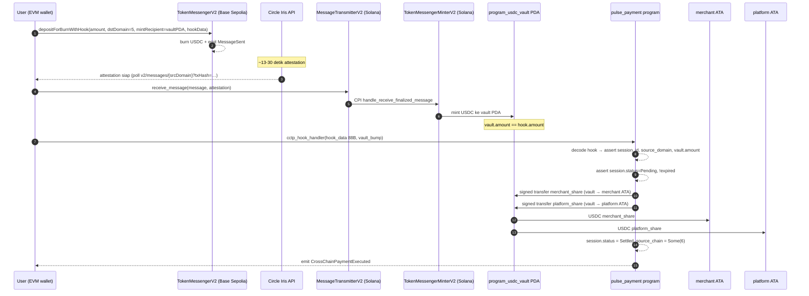
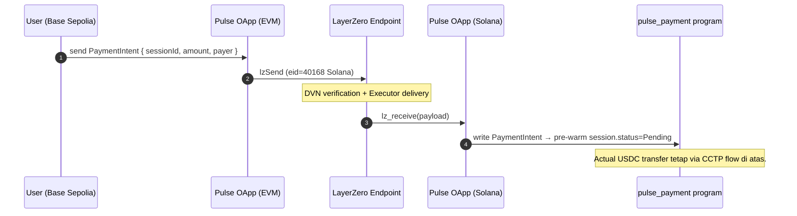

# Pulse Cross-Chain Layer (Devnet)

CCTP V2 + LayerZero V2 OApp integration untuk Pulse — memungkinkan pembayaran masuk dari chain EVM dan otomatis ter-split di Solana Devnet.

> **Scope file ini: DEVNET / TESTNET ONLY.** Mainnet di luar scope.

---

## 1. Architecture diagram

```mermaid
flowchart LR
    subgraph EVM["Base Sepolia (EVM)"]
        U[User Wallet] -->|approve USDC| TM[TokenMessengerV2<br/>0x8FE6...2DAA]
        U -->|depositForBurnWithHook<br/>amount + hookData 88B| TM
        TM -->|burn USDC| MT_EVM[MessageTransmitterV2<br/>0xE737...E275]
    end

    MT_EVM -.->|emit MessageSent| ATT[Circle Iris Attestation<br/>iris-api-sandbox.circle.com]

    subgraph SOL["Solana Devnet"]
        REL[Relayer / User] -->|receive_message<br/>+ attestation| MT_SOL[MessageTransmitterV2<br/>CCTPV2Sm...PbeC]
        MT_SOL -->|CPI handle_receive_finalized_message| TMM[TokenMessengerMinterV2<br/>CCTPV2vP...UMQe]
        TMM -->|mint USDC| VAULT[program_usdc_vault PDA<br/>seeds=vault, session]

        REL -->|cctp_hook_handler<br/>hook_data + vault_bump| PULSE[pulse_payment program<br/>Gh2NP3fB...j8d2]
        VAULT --> PULSE
        PULSE -->|transfer 90%| MERCH[merchant USDC ATA]
        PULSE -->|transfer 10%| PLAT[platform USDC ATA]
        PULSE -.->|emit| EV[CrossChainPaymentExecuted]
    end

    ATT -. attestation .-> REL
```



---

## 2. Sequence diagram — CCTP flow



---

## 3. Sequence diagram — LayerZero V2 (Phase 2, optional)



---

## 4. Module layout

```
contracts/programs/pulse_payment/
├── Cargo.toml                  ← anchor-lang init-if-needed + anchor-spl
├── cross_chain/
│   ├── README.md               ← file ini
│   └── SETUP.md                ← env setup reproducible
└── src/
    ├── lib.rs                  ← #[program] entrypoints
    ├── errors.rs               ← CrossChainError range 6100-6199
    ├── events.rs               ← CrossChainPaymentExecuted, LzPaymentIntentReceived
    ├── state/
    │   ├── mod.rs
    │   └── mock.rs             ← Merchant + PaymentSession + internal_execute_split (mock)
    ├── cross_chain/
    │   ├── mod.rs
    │   ├── cctp_addresses.rs   ← CCTP V2 program IDs + USDC mint + domains
    │   └── hook_data.rs        ← PulseHookData decode (88 bytes BE)
    └── instructions/
        ├── mod.rs
        └── cross_chain/
            ├── mod.rs
            └── cctp_hook.rs    ← cctp_hook_handler instruction
```

```
packages/solana/src/
├── cctp/
│   ├── index.ts
│   ├── types.ts                ← PulseHookData, CctpDomain, IrisAttestationResponse
│   ├── addresses.ts            ← Solana + EVM program/contract addresses
│   ├── encode-hook.ts          ← encodeHookData / decodeHookData (mirror Rust)
│   ├── attestation.ts          ← fetchAttestation / pollAttestation (Iris sandbox)
│   └── redeem-on-solana.ts     ← deriveReceiveMessagePdas, derivePulseVaultAuthority
└── cross-chain/
    ├── index.ts
    └── config.ts               ← CROSS_CHAIN_CONFIG + assertNonMainnetCluster()
```

---

## 5. Setup guide untuk dev lain

Lihat [`SETUP.md`](./SETUP.md) untuk install Rust/Solana/Anchor/Docker, generate keypair devnet, fund USDC. TL;DR setelah onboarding:

```bash
# Verify env
solana --version            # 3.1.x (Agave)
anchor --version            # 0.31.1
solana balance -k contracts/.keys/pulse-deploy.json -u devnet  # >= 2 SOL

# Build program
cd contracts && NO_DNA=1 anchor build
# → target/deploy/pulse_payment.so (~250 KB)
# → target/idl/pulse_payment.json

# Optional: deploy ke devnet (pakai SOL dari pulse-deploy keypair)
anchor deploy --provider.cluster devnet

# Run E2E test (butuh EVM_PRIVATE_KEY testnet — lihat .env.cctp.example)
cp contracts/.env.cctp.example contracts/.env
# isi EVM_PRIVATE_KEY dengan testnet wallet sendiri
pnpm tsx contracts/tests/cctp-e2e.ts
```

---

## 6. Hook data layout

Total **88 bytes**, big-endian (mirror EVM ABI raw bytes):

| offset | size | field           | catatan                                      |
|--------|------|-----------------|----------------------------------------------|
| 0      | 32   | `session_id`    | Random 32-byte id PaymentSession             |
| 32     | 4    | `source_domain` | CCTP domain id (u32 BE)                      |
| 36     | 20   | `original_sender`| EVM address user (display + analytics)      |
| 56     | 8    | `amount`        | u64 BE — sanity check vs vault.amount        |
| 64     | 24   | `nonce_tag`     | u192 BE — random tag, audit-only             |

Decoder Rust: [`hook_data.rs`](../src/cross_chain/hook_data.rs).
Encoder TS: [`encode-hook.ts`](../../../../packages/solana/src/cctp/encode-hook.ts).

---

## 7. PDA seeds

| PDA                       | Seeds                                        | Catatan                          |
|---------------------------|----------------------------------------------|----------------------------------|
| `Merchant`                | `["merchant", owner.key()]`                  | Owner = signer at init           |
| `PaymentSession`          | `["session", merchant.key(), session_id]`    | session_id 32 bytes              |
| `vault_authority`         | `["vault", session.key()]`                   | Authority untuk USDC ATA vault   |
| `program_usdc_vault`      | ATA(`vault_authority`, USDC mint)            | Standar SPL ATA                  |

---

## 8. Error codes

Range Pulse cross-chain: **6100–6199**. Lihat [`errors.rs`](../src/errors.rs) untuk daftar lengkap.

| Kode | Nama                          | Kapan terjadi                              |
|------|-------------------------------|--------------------------------------------|
| 6100 | `InvalidHookDataLength`       | Hook data bukan 88 bytes                   |
| 6101 | `HookSessionMismatch`         | session_id di hook ≠ session PDA           |
| 6102 | `UnsupportedSourceDomain`     | source_domain bukan {0,1,3,6}              |
| 6103 | `VaultBalanceInsufficient`    | Vault USDC < amount (mint belum ter-flush) |
| 6104 | `SessionNotPending`           | Session sudah Settled/Expired/Refunded     |
| 6105 | `SessionExpired`              | unix_now > session.expires_at              |
| 6106 | `InvalidVaultAuthority`       | Vault owner ≠ vault_authority PDA          |
| 6107 | `InvalidVaultMint`            | Vault mint ≠ USDC devnet                   |
| 6108 | `InvalidCctpAttestation`      | used_nonce account bukan owned by MT-V2    |
| 6109 | `MainnetForbidden`            | Cluster mengarah ke mainnet                |
| 6110 | `LzPeerNotSet`                | LayerZero peer EID belum di-set            |
| 6111 | `LzPayloadInvalid`            | LZ payload Borsh deserialize fail          |

---

## 9. Troubleshooting

### `Transaction too large`
- CCTP flow standar Solana sudah cukup tight, tapi LayerZero V2 sering kena ini di Solana (account list besar).
- Solusi: pakai **Address Lookup Table (ALT)**. `loosen_cpi_size_restriction` belum aktif di devnet/mainnet.

### `ATA tidak exist` untuk merchant
- Handler kita pakai `init_if_needed` di `merchant_usdc_ata` — auto-create kalau belum ada. Pastikan `completer` (signer) punya cukup SOL untuk rent (~0.002 SOL).

### Attestation pending lama (>30 detik)
- Iris sandbox kadang slow saat off-peak. Default polling timeout 3 menit.
- Cek manual:  
  `curl https://iris-api-sandbox.circle.com/v2/messages/6?transactionHash=0x...`

### `InvalidHookDataLength` (6100)
- Encoder TypeScript HARUS produce 88 bytes. Common bug: kelupaan pad EVM address ke 20 bytes raw, atau pakai 32-byte session id versus pubkey 32-byte → mismatch tidak akan trigger ini, tapi ukuran total iya. Verifikasi via `decodeHookData(buf).then(hex => hex.byteLength === 88)`.

### `VaultBalanceInsufficient` (6103) padahal CCTP tx success
- Berarti USDC ter-mint ke ATA yang berbeda. Pastikan saat encode `mintRecipient` di EVM = bytes raw `vault_authority`'s **ATA**, bukan vault_authority PDA itu sendiri.
  - Untuk Pulse: `vault_ata = getAssociatedTokenAddress(USDC, vault_authority, /* allowOwnerOffCurve= */ true)`.
- CCTP V2 mint USDC ke recipient ATA yang harus existing — atau ke ATA yang akan di-create sebagai bagian dari receive_message (validasi setup ATA dulu).

### Compute Unit habis
- Default CU = 200_000. Hook handler + 2× SPL transfer + ATA init ≈ 80–120k. Kalau ada CPI tambahan dari real `internal_execute_split` (multi-beneficiary), tambahkan:
  ```ts
  ComputeBudgetProgram.setComputeUnitLimit({ units: 400_000 })
  ```
  Profile via `solana logs <txSig>` setelah deploy.

### `Account does not exist` untuk used_nonces PDA
- Wajib di-derive dengan `bucket = floor(nonce / 6400)`, big-endian u64. Lihat `redeem-on-solana.ts:deriveReceiveMessagePdas`.

### Anchor build fail dengan `unresolved import 'crate'` di #[program]
- Anchor 0.31 macro generate `__client_accounts_<struct_snake_case>` di crate root. Re-export Accounts struct di `lib.rs` via `pub use instructions::*;` (sudah di-handle di repo ini).

---

## 10. Open work / known gaps

- **CCTP nonce verification on-chain**: saat ini `cctp_hook_handler` percaya pada vault balance + session_id match, tidak validasi used_nonces account. Nice-to-have: terima `used_nonces` account constraint dengan `owner = MessageTransmitterV2 program`.
- **LayerZero Phase 2**: skeleton belum di-tulis (lihat task spec). Target: `init_oapp`, `set_peer`, `lz_receive`, `lz_receive_types`.
- **Real `internal_execute_split` integration**: saat ini mock di `state/mock.rs`. Tunggu core-program owner expose helper. Signature sudah dikunci supaya tidak blocking.
- **E2E test runner**: Phase 1.4 script di-skeleton kan saja — leg EVM (viem) belum dijalankan auto. Butuh user consent + funded wallet sebelum execute.
